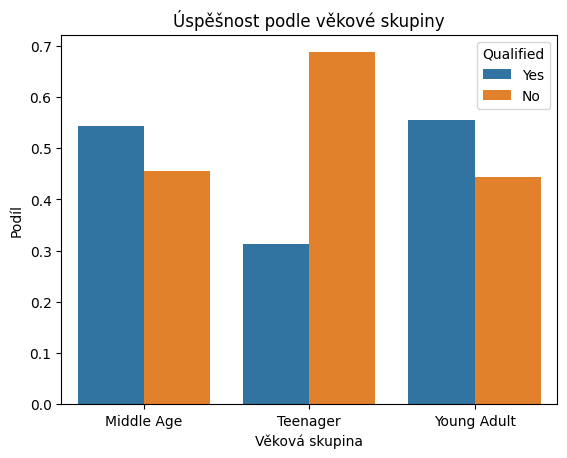
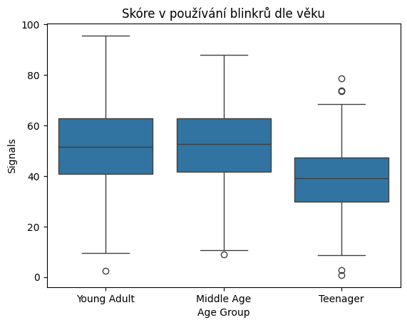
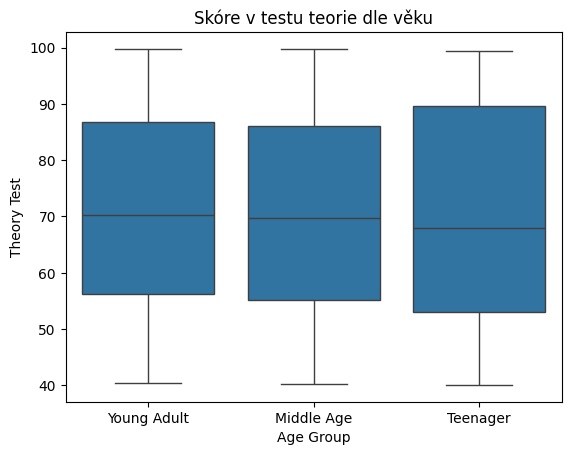

# Driver's License Test Scores - Statistická Práce

Níže je uvedena statistická analýza dat zveřejněných na webu kaggle, přesněji: https://www.kaggle.com/datasets/ferdinandbaidoo/drivers-license-test-scores-data . Řeším otázky, zda má pohlaví, věk či rasa nějaký vliv na výsledky závěrečných testů v autoškole popř. i nějaké podotázky jako jsou parkování, správné používání blinkrů nebo výsledky teoretických testů.

## Základní zpracování dat a informace


```python
# import potřebných knihoven
import pandas as pd 
import numpy as np
import matplotlib.pyplot as plt
import seaborn as sns
import scipy.stats as st
```


```python
# načtení a prasování dat
df = pd.read_csv("drivers_licence_data.csv")
df.head()
```


<div>
<style scoped>
    .dataframe tbody tr th:only-of-type {
        vertical-align: middle;
    }

    .dataframe tbody tr th {
        vertical-align: top;
    }

    .dataframe thead th {
        text-align: right;
    }
</style>
<table border="1" class="dataframe">
  <thead>
    <tr style="text-align: right;">
      <th></th>
      <th>Applicant ID</th>
      <th>Gender</th>
      <th>Age Group</th>
      <th>Race</th>
      <th>Training</th>
      <th>Signals</th>
      <th>Yield</th>
      <th>Speed Control</th>
      <th>Night Drive</th>
      <th>Road Signs</th>
      <th>Steer Control</th>
      <th>Mirror Usage</th>
      <th>Confidence</th>
      <th>Parking</th>
      <th>Theory Test</th>
      <th>Reactions</th>
      <th>Qualified</th>
    </tr>
  </thead>
  <tbody>
    <tr>
      <th>0</th>
      <td>AID0001</td>
      <td>Male</td>
      <td>Young Adult</td>
      <td>Other</td>
      <td>NaN</td>
      <td>38.48</td>
      <td>30.29</td>
      <td>37.03</td>
      <td>33.53</td>
      <td>39.61</td>
      <td>58.16</td>
      <td>53.42</td>
      <td>35.32</td>
      <td>38.19</td>
      <td>70.68</td>
      <td>Average</td>
      <td>No</td>
    </tr>
    <tr>
      <th>1</th>
      <td>AID0002</td>
      <td>Female</td>
      <td>Young Adult</td>
      <td>Black</td>
      <td>NaN</td>
      <td>51.76</td>
      <td>19.13</td>
      <td>63.05</td>
      <td>34.87</td>
      <td>19.56</td>
      <td>16.48</td>
      <td>27.97</td>
      <td>22.91</td>
      <td>24.23</td>
      <td>78.18</td>
      <td>Average</td>
      <td>No</td>
    </tr>
    <tr>
      <th>2</th>
      <td>AID0003</td>
      <td>Male</td>
      <td>Middle Age</td>
      <td>Black</td>
      <td>NaN</td>
      <td>30.21</td>
      <td>48.13</td>
      <td>43.13</td>
      <td>42.43</td>
      <td>60.93</td>
      <td>20.74</td>
      <td>28.86</td>
      <td>32.32</td>
      <td>44.11</td>
      <td>79.60</td>
      <td>Fast</td>
      <td>Yes</td>
    </tr>
    <tr>
      <th>3</th>
      <td>AID0004</td>
      <td>Male</td>
      <td>Young Adult</td>
      <td>Other</td>
      <td>NaN</td>
      <td>34.75</td>
      <td>47.28</td>
      <td>50.49</td>
      <td>42.10</td>
      <td>22.52</td>
      <td>33.87</td>
      <td>48.52</td>
      <td>24.90</td>
      <td>37.56</td>
      <td>57.34</td>
      <td>Average</td>
      <td>No</td>
    </tr>
    <tr>
      <th>4</th>
      <td>AID0005</td>
      <td>Male</td>
      <td>Teenager</td>
      <td>Other</td>
      <td>Advanced</td>
      <td>78.52</td>
      <td>83.93</td>
      <td>59.79</td>
      <td>52.68</td>
      <td>67.47</td>
      <td>89.24</td>
      <td>30.31</td>
      <td>43.85</td>
      <td>55.91</td>
      <td>78.44</td>
      <td>Average</td>
      <td>Yes</td>
    </tr>
  </tbody>
</table>
</div>


!!! Pokud někde používám hladinu významnosti $\alpha$, tak je rovna klasické hodnotě $0.05$. !!!

!!! Pokud někde odpovídám stylem: "Pohlaví má nebo nemá vliv na výsledky", tak je to vždy vůči těmto naměřeným datům a zvolené hladině významnosti !!!

## Vliv pohlaví, věku, rasy a trénovanosti na výsledek celého testu

Cílem následujících testů je najít závislost mezi jednotlivými kategoriemi a výsledkem testů. Na tyto otázky odpovíme pomocí jednoduchých chi-kvadrát testů, určeme hypotézy.
$$
\begin{aligned}
H_0 &:= \; \text{Pohlaví (věk,...) nemá vliv na výsledek zkoušky} \\
H_1 &:= \; \text{Pohlaví (věk,...) má vliv na výsledek zkoušky}
\end{aligned}
$$
Nejprve se podívejme na pohlaví.


### Pohlaví


```python
# Vytvoření kontingenční tabulky pro pohlaví a výsledek zkoušky
cont_table = pd.crosstab(df['Gender'], df['Qualified'])
print(cont_table)
```

    Qualified   No  Yes
    Gender             
    Female     131  125
    Male       120  124


Na pohled vidíme větší úspěšnost u mužů, ale pojďme provést daný test a podívat se na konkrétní hodnoty, abychom věděli, zda je rozdíl markantní nebo ne.


```python
chi2, p, dof, expected = st.chi2_contingency(cont_table) # Provedení chi–kvadrát testu

print("Chi-kvadrát:", chi2)
print(f"p-hodnota: {p:.6f}")
```

    Chi-kvadrát: 0.12654352059796886
    p-hodnota: 0.722043


Naštěstí nám vyšla p-hodnota daleko vyšší než je zvolená hladina významnosti $\alpha$, tedy pohlaví a výsledek zkoušky na sebe nemají žádný vliv.

### Věk

Nyní se podívejme na věk, nejprve z deskriptivního pohledu dat (předešlá data jsme zobrazovali pomocí kontingenční tabulky, zde si je můžeme zobrazit třeba grafem).


```python
prop_table = (df.groupby("Age Group")["Qualified"]
                .value_counts(normalize=True)
                .rename("Proportion")
                .reset_index())

sns.barplot(x="Age Group", y="Proportion", hue="Qualified", data=prop_table)
plt.title("Úspěšnost podle věkové skupiny")
plt.xlabel("Věková skupina")
plt.ylabel("Podíl")
plt.show()
```


    

    


Zde je ten rozdíl daleko větší, zatím bez jakýchkoliv testů vidíme, že věková skupina "Teenager" má daleko horší výsledky, nežli zbylé dvě. Proveďme tedy test, který by měl nulovou hypotézu zamítnout.


```python
cont_table = pd.crosstab(df['Age Group'], df['Qualified'])
chi2, p, dof, expected = st.chi2_contingency(cont_table)

print("Chi-kvadrát:", chi2)
print(f"p-hodnota: {p:.6f}")
```

    Chi-kvadrát: 19.91687479950254
    p-hodnota: 0.000047


Výsledná p–hodnota je daleko nižší, nežli zvolená $\alpha$, tedy můžeme zamítnout nulovou hypotézu a prohlásit, že věk má vliv na výsledek zkoušky.

### Rasa

Zde už bez komentářů opět zobrazíme data a provedeme chí-kvadrát test.


```python
cont_table = pd.crosstab(df['Race'], df['Qualified'])
print(cont_table)
chi2, p, dof, expected = st.chi2_contingency(cont_table)

print("\nChi-kvadrát:", chi2)
print(f"p-hodnota: {p:.6f}")
```

    Qualified  No  Yes
    Race              
    Black      82   82
    Other      84   87
    White      85   80
    
    Chi-kvadrát: 0.1961498688604218
    p-hodnota: 0.906581


Pro vyšší p-hodnotu nežli je zvolená $\alpha$ rasa nemá vliv na celkový výsledek testů.

### Trénink


```python
cont_table = pd.crosstab(df['Training'], df['Qualified']) # Vytvoření kontingenční tabulky pro trénink a výsledek
print(cont_table)
chi2, p, dof, expected = st.chi2_contingency(cont_table) # Provedení testu

print("\nChi-kvadrát:", chi2)
print(f"p-hodnota: {p:.9f}")
```

    Qualified  No  Yes
    Training          
    Advanced   18  134
    Basic      85  113
    
    Chi-kvadrát: 38.530537101708745
    p-hodnota: 0.000000001


Zde vyšla p–hodnota velice malá (menší nežli $\alpha$), tedy zamítáme $H_0$ a příjímáme hypotézu, že trénink vliv na výsledek má.

## Pozorování z předešlých testů

Dle jednoduchých chi-kvadrát testů jsme zjistili, že pohlaví a rasa vliv na celkový výsledek testů nemají a naopak věk a trénink vliv mají. Co dále nám nabízejí data jsou jednotlivá skóre získaná při částech, ze kterých se test skládá, tedy parkování, teorie, blinkry,... Zkoumat zda se přeci jen neliší výsledky v jednotlivých kategoriích je asi ztráta času, jelikož pokud nemají vliv na celkové skóre, je dost nepravděpodobné, že budou mít vliv na nějakou část testu a jinde to zase doženou. Zajímavější mi přijde ta druhá strana a to zkusit najít nějakou část testu, kde třeba není tak markantní rozdíl mezi trénovanými/ netrénovanými, starými/ mladými nebo naopak najít místo, kde ten rozdíl je.

## Vliv věku na jednotlivé disciplíny testu

Pojďme se tedy podívat na věk a jeho vliv. Na začátku jsme zjistili, že věk se na celkovém výsledku odrazí, jelikož teenageři mají výsledky horší než ostatní. Nyní se podívejme, jestli přece jen neexistuje kategorie, kde by třeba věk nehrál až takovou roli. K tomu nám pomůže ANOVA test (analýza rozptylu), který vezme průměrnou hodnotu těchto, u nás tří (teenager, young adult, middle age), skupin a rozhodne, zda-li se průměry liší markantně či nikoliv (za pomoci vnitřních rozdílů mezi jednotlivými měřeními.) Pro lepší pochopení se podívejme na věk a používání blinkrů.

$$
\begin{aligned}
H_0 &:= \; \text{Věk nemá vliv na skóre dosažené v dané kategorii} \\
H_1 &:= \; \text{Věk vliv má}
\end{aligned}
$$

### Věk a používání blinkrů


```python
sns.boxplot(x="Age Group", y="Signals", data=df)
plt.title("Skóre v používání blinkrů dle věku")
plt.xlabel("Age Group")
plt.ylabel("Signals")
plt.show()
```


    

    


Na grafu lze vidět, že teenageři nedosahují tak dobrých výsledků jako ostatní věkové kategorie, ale přesto se podívejme na test, abychom se ujistili, že daný rozdíl je dostatečný.


```python
# rozdělíme data dle věku a vytáhneme hodnoty v kategorii Signals
groups = [g["Signals"].values for _, g in df.groupby("Age Group")] # [[skore pro teenagery...],[...],[...]]

# ANOVA
fstat, pval = st.f_oneway(*groups)

print(f"F-statistika: {fstat:.3f}")
print(f"p-hodnota: {pval:.12f}")
```

    F-statistika: 26.470
    p-hodnota: 0.000000000012


Pro velice malou p-hodnotu zamítáme nulovou hypotézu a můžeme říct, že věk má vliv na skóre dosažené v kategorii Signals. Další kategorie jako je parkování, používání zrcátek nebo sebevědomí za volantem vyšla všechna podobně a to, že věk má vliv na danou kategorii (neuvádím je zde, jelikož jsou velice podobná tomuto testu a nic nového by nepřinesly.)

### Věk a teorie

Na závěr se pojďme podívat asi na jediný trochu zajímavější test. Zobrazme si data, která popisují, jak si jednotlivé věkové kategorie vedli v teoretickém testu.


```python
sns.boxplot(x="Age Group", y="Theory Test", data=df)
plt.title("Skóre v testu teorie dle věku")
plt.xlabel("Age Group")
plt.ylabel("Theory Test")
plt.show()
```


    

    


Tohle vypadá velice slibně, rozdíl není až tak velký... udělejme tedy test.


```python
groups = [g["Theory Test"].values for _, g in df.groupby("Age Group")]

# ANOVA
fstat, pval = st.f_oneway(*groups)

print(f"F-statistika: {fstat:.3f}")
print(f"p-hodnota: {pval:.6f}")
```

    F-statistika: 0.009
    p-hodnota: 0.990860


Našli jsme kategorii, kde věk nemá vliv na výsledek, jelikož $p \gt \alpha$. Tedy konstatovat, že teenageři jsou horší řidiči dává smysl pouze v praktických částech testu, nikoliv v té teoretické.

## Intervalový test pro průměr v parkování

Na úplný závěr si jen zkusme intervalový test pro nějakou kategorii, zvolil jsem parkování.


```python
scores = df["Theory Test"].dropna()

mean = np.mean(scores)
sem = st.sem(scores)  # standarní chyba průměru
ci = st.t.interval(confidence=0.95, df=len(scores)-1,
                   loc=mean, scale=sem)

print(f"Průměr z dat: {mean:.2f}")
low, high = ci
print(f"Interval, který s 95% spolehlivostí pokrývá skutečný průměr: ({low:.2f}, {high:.2f})")
```

    Průměr z dat: 70.62
    Interval, který s 95% spolehlivostí pokrývá skutečný průměr: (69.05, 72.19)


## Závěr

Ve statistické práci jsme nenašli nějaký silnější vztah mezi pohlavím/ rasou a výsledkem testu. Dále jsme potvrdili asi očividné, a to sice, že trénovanost a věk vliv na výsledek mají. Takové vlastní statistické vítězství beru v tom, že jsem si dokázal vlastní pozorováníčko a našel kategorii, kde věk nehraje roli (pozorování jsem učinil před deskriptivním pohledem na data). Dále považuji za vhodné uvést, že práce byla psána s pomocí AI, která mi pomohla najít jednotlivé funkce, které provádějí danou statistiku (jako jsou chi-kvadrát nebo ANOVA).

---  
**Jan Palatka**  
*Pravděpodobnost a Statistika 1*  
9. 9. 2025


```python

```
